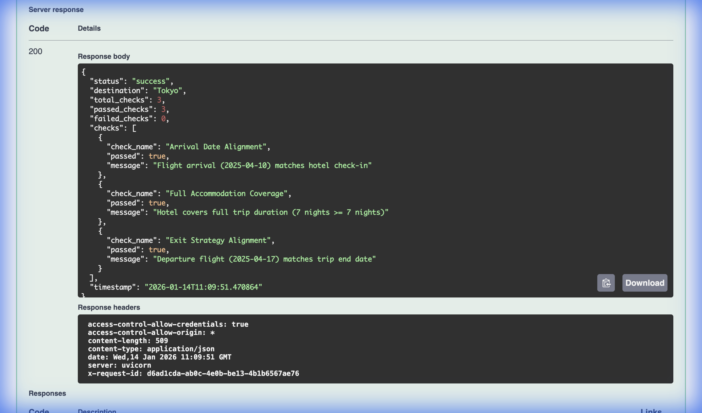
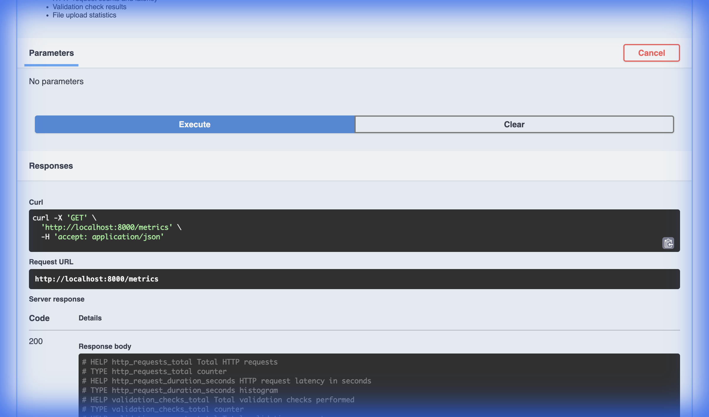

# 🧳 Travel Readiness Sentinel

> **An intelligent API that validates travel itineraries to prevent booking errors**

[](https://www.python.org/)
[](https://fastapi.tiangolo.com/)
[](https://www.docker.com/)
[](tests/)

---

## 💡 What Does This Do?

Ever booked a flight that departs **before** your hotel checkout? Or arrived at your destination **after** your hotel check-in time? This API automatically catches these mistakes **before** you book.

**Real-world problem it solves:**
- ✅ Validates flight dates match hotel reservations
- ✅ Ensures your hotel covers your entire trip
- ✅ Checks you have a flight home on your last day
- ✅ Prevents costly booking errors

---

## 🎯 Why I Built This

This project demonstrates my ability to build **production-ready backend systems** with:
- Modern Python web frameworks (FastAPI)
- RESTful API design
- Docker containerization
- Automated testing
- Production observability (logging, metrics)
- Clean code architecture

---

## 📸 See It In Action

### Interactive API Documentation

*Swagger UI with automatic validation and request tracing*

### Real-Time Monitoring

*Prometheus metrics for production monitoring*

---

## 🚀 Quick Start

### Try It Yourself (2 minutes)

```bash
# 1. Clone and start with Docker
git clone https://github.com/harveycyl/travel-readiness-sentinel.git
cd travel-readiness-sentinel
docker-compose up

# 2. Open your browser
open http://localhost:8000/docs

# 3. Try the /validate endpoint with sample data
```

That's it! The interactive docs let you test the API directly in your browser.

---

## 🛠️ Technical Highlights

### **Backend Skills Demonstrated**

| Skill | Implementation |
|-------|---------------|
| **API Development** | FastAPI with 5 REST endpoints, auto-generated OpenAPI docs |
| **Data Validation** | Pydantic models with custom business logic validators |
| **Testing** | 53 automated tests (100% pass rate), pytest framework |
| **Containerization** | Multi-stage Docker build, docker-compose orchestration |
| **Observability** | Structured JSON logging, Prometheus metrics, request tracing |
| **Code Quality** | Type hints, modular architecture, abstract base classes |

### **Architecture**

```
┌─────────────┐
│   Client    │
└──────┬──────┘
       │
       ▼
┌─────────────────────────────────┐
│      FastAPI Application        │
│  ┌──────────────────────────┐  │
│  │  Logging Middleware      │  │ ← Request tracing
│  └──────────────────────────┘  │
│  ┌──────────────────────────┐  │
│  │  Validation Engine       │  │ ← Business logic
│  └──────────────────────────┘  │
│  ┌──────────────────────────┐  │
│  │  Metrics Collection      │  │ ← Prometheus
│  └──────────────────────────┘  │
└─────────────────────────────────┘
```

---

## 📊 Key Features

### For Users
- 🌐 **RESTful API** - Standard HTTP endpoints, works with any client
- 📤 **Multiple Input Formats** - JSON, YAML, or Excel files
- 🔍 **Smart Validation** - Catches logical errors, not just data format issues
- 📚 **Self-Documenting** - Interactive Swagger UI included

### For Operations
- 🐳 **Docker Ready** - One command deployment
- 📈 **Production Monitoring** - Prometheus metrics built-in
- 📝 **Structured Logging** - JSON logs with request IDs for tracing
- ✅ **Health Checks** - Kubernetes/load balancer compatible

---

## 🧪 Testing

Comprehensive test coverage across all layers:

```bash
pytest tests/ -v

# Results: 53 tests, 100% passing
# ✅ Unit tests (models, validation logic)
# ✅ Integration tests (API endpoints)
# ✅ End-to-end tests (full workflows)
```

---

## 📖 API Endpoints

| Endpoint | Purpose | Example |
|----------|---------|---------|
| `GET /health` | Service health check | Returns operational status |
| `GET /metrics` | Prometheus metrics | Request counts, latency, errors |
| `POST /validate` | Validate JSON itinerary | Returns validation results |
| `POST /upload` | Validate Excel/YAML file | Accepts file upload |
| `GET /docs` | Interactive documentation | Swagger UI |

---

## 💻 Technology Stack

**Core:**
- Python 3.9+
- FastAPI (async web framework)
- Pydantic (data validation)
- Uvicorn (ASGI server)

**Observability:**
- Prometheus (metrics)
- Structured JSON logging
- Request tracing

**Development:**
- pytest (testing)
- Docker & Docker Compose
- Type hints throughout

---

## 🎓 What I Learned

Building this project taught me:

1. **API Design** - How to design intuitive, RESTful endpoints
2. **Data Validation** - Implementing business logic vs schema validation
3. **Production Readiness** - Logging, metrics, health checks, error handling
4. **Testing Strategy** - Unit, integration, and end-to-end test patterns
5. **Containerization** - Multi-stage Docker builds, optimization
6. **Code Organization** - Clean architecture with separation of concerns

---

## 🚢 Deployment

### Local Development
```bash
python -m uvicorn src.api:app --reload
```

### Production (Docker)
```bash
docker build -t trs-api .
docker run -p 8000:8000 \
  -e LOG_FORMAT=json \
  -e ENABLE_METRICS=true \
  trs-api
```

### Cloud Platforms
Works with: AWS ECS, Google Cloud Run, Azure Container Instances, Railway, Render

---

## 📁 Project Structure

```
travel-readiness-sentinel/
├── src/
│   ├── __main__.py          # CLI entry point
│   ├── api.py               # FastAPI application
│   ├── core/                # Business logic
│   │   ├── model.py         # Data models
│   │   ├── validation.py    # Validation rules
│   │   └── schemas.py       # API schemas
│   └── ingestion/           # File parsers
│       ├── excel.py         # Excel reader
│       └── yaml.py          # YAML reader
├── tests/                   # 53 automated tests
├── examples/                # Sample itineraries
├── Dockerfile               # Container definition
└── docker-compose.yml       # Local development
```

---

## 🤝 Contact

**Harvey Lam**
- 📧 Email: harveylam92126@gmail.com
- 💼 GitHub: [@harveycyl](https://github.com/harveycyl)

---

## 📄 License

MIT License - feel free to use this project as a reference or starting point for your own work.

---

<div align="center">

**Built with ❤️ to demonstrate production-grade Python development**

*This project showcases real-world backend engineering skills applicable to any API-driven application*

</div>
